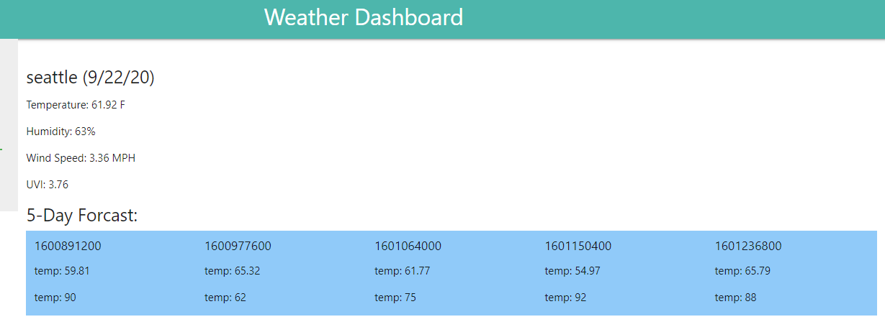
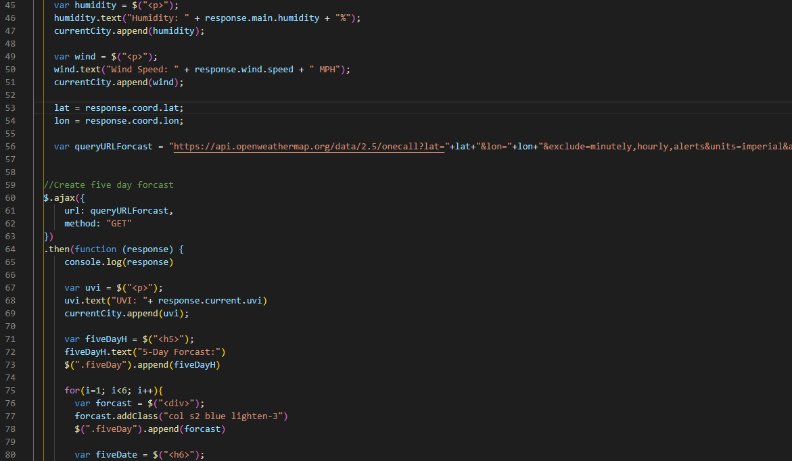

# weather-app

Nothings worse than planning a trip getting everything ready and getting there only for the weather to, pardon my pun but rain on your parade. Well with this handy little weather app you'll not be caught off guard again.

Ultimately with this project I wanted to dive deep into an api and find ways to iterate upon the called information to make it quickly accessible. Taking a basic html framework and dynamically adding elements as the user calls upon them. In this case the user is tasked with entering a city and the app will return the current weather as well as provide a five day forcast. 

## Problems solved and take aways.

Once the openweather api was set up calling the information I needed was pretty simple. The documentation was straightforward and clear to the point where integration wasn't difficult. Once I could make an ajax call I could start to sort through the info and dynamically call up the information needed. 

The real meat of this problem was to create a five day forcast. I knew I could simply hard code out five seperate days calling upon the different indexes they could be found in. That seemed a little wet for my liking. So I set fourth to create a for loop that could produce a div that would hold the days temp and humidity for the next five days for the given location. Happy to say that worked. 

### tools used
open weather map api: https://openweathermap.org/